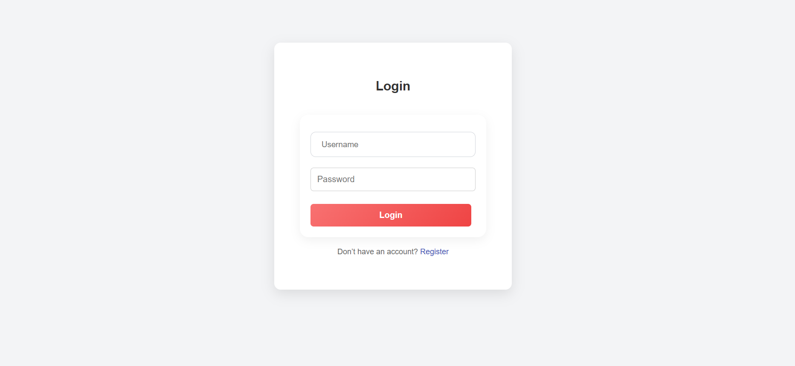
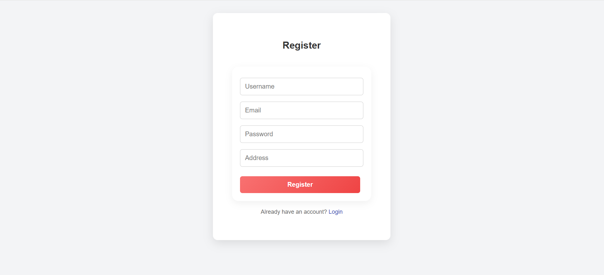
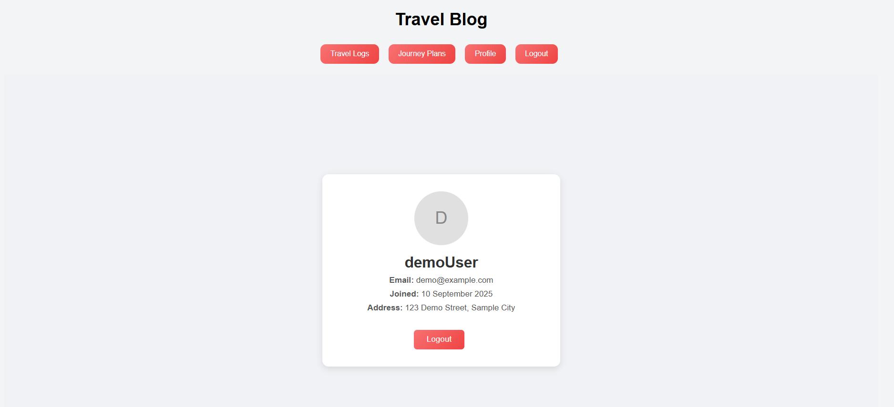
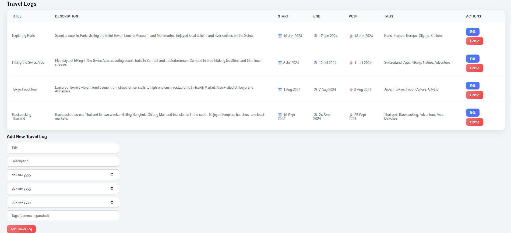
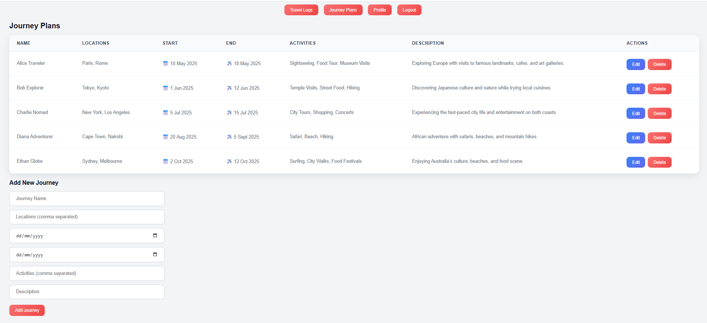

# 🌍 Travel Blog App  

A full-stack travel log application where users can register, log in, and share their travel experiences or future journey plans. Built with **React, Node.js, Express, and MySQL** for a clean, responsive, and interactive web experience. 

## ✨ Features  

- 🔐 **Authentication**: Register & log in with secure password hashing (bcrypt).  
- 📝 **Travel Logs**: Create, view, edit, and delete travel logs with title, description, dates, and tags.  
- 🗺️ **Journey Plans**: Plan future trips by adding destinations, activities, and travel dates.  
- 📂 Organized **frontend & backend structure** with controllers, routes, and models.  
- 🌐 RESTful API communication using **Axios**.  

---

## 🛠️ Tech Stack  

**Frontend**  
- React  
- React Router  
- Axios  
- CSS  

**Backend**  
- Node.js  
- Express  
- bcrypt for authentication  
- dotenv for environment variables  
- CORS  

**Database**  
- MySQL  

---

## 📸 Screenshots  

### Login Page  
  

### Register Page  
  

### Profile Page  
  

### Travel Logs Page  
  

### Journey Plans Page  
  

---

## 🚀 Getting Started  

```bash
# 1. Clone the Repository
git clone https://github.com/samuelo21423/Travel-Blog-App.git
cd Travel-Blog-App

# 2. Install Dependencies

# Backend
cd backend
npm install

# Frontend
cd ../frontend
npm install

# 3. Configure Environment Variables
# Create a .env file inside backend/ with your database credentials and JWT secret:
# Example:
# DB_HOST=localhost
# DB_USER=root
# DB_PASSWORD=yourpassword
# DB_NAME=travel_blog
# JWT_SECRET=yourSecretKey

# 4. Run the Application

# Backend
cd ../backend
npm start

# Frontend
cd ../frontend
npm start

# 5. Access the App
# Open your browser and go to http://localhost:3000
# Register a user, log in, create travel logs, and plan journeys.
